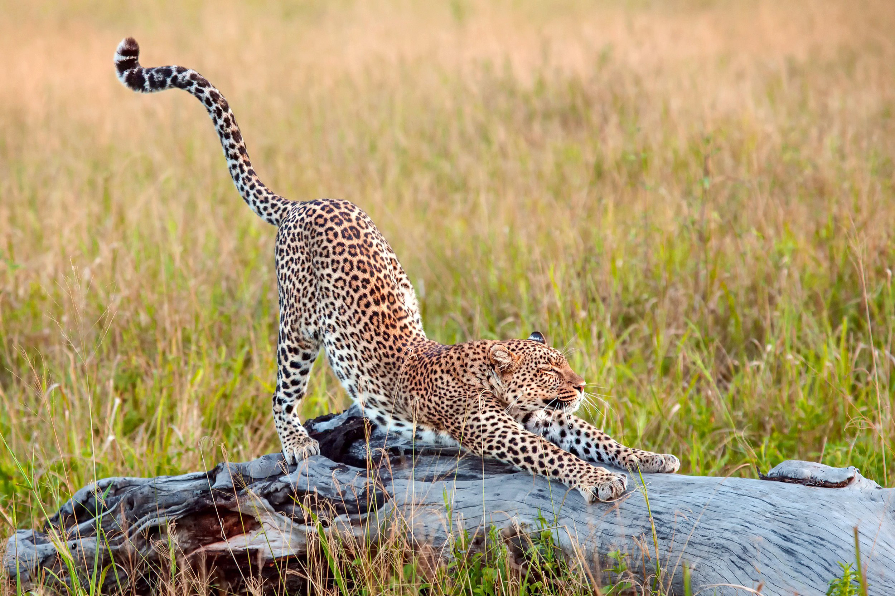

```{r setup, include=FALSE}
knitr::opts_chunk$set(echo = TRUE)
```
***

Atypical for a zoologist, I'm terrified of most animals. Growing up in the wildlife paradise of Stoke-on-Trent, my mother's response was a fairly standard "they're more scared of you than you are of them". Maybe that's not true of my childhood interactions with Canadian Geese - but new research published in the journal [*Science*](http://science.sciencemag.org/content/360/6394/1232) highlights widespread changes in the behaviour of mammals, which the authors attribute to fear of humans. We're driving our fellow mammals into the night: increasing nocturnal activity in the presence of human activity, on average, by a factor of 1.36<sup id = "a1">[1](#f1)</sup>. This means, for example, that if a species naturally split its activity 50% day and 50% night, around humans the night time activity would increase to 68%.

<figure>
  
  <figcaption>  The black bear, *Ursus americanus*, is amongst large predetors showing increased night time activity in response to people. Image: Cephas/Wikimedia Commons, CC BY-SA 3.0</figcaption>
</figure>

What is it that we're doing to push our Class-mates under the cover of darkness? The authors pulled together 76 studies, from across the globe, measuring activity patterns in relation to anthropogenic stressors including vehicles, agriculture, mining, hunting, building works, and even hiking. Significant increases to nocturnality were found in response to *every single form* of human presence that they tested. Surprisingly, the diel pattern shifts caused by non-lethal activities like hiking and other recreational activities were statistically indistinguishable from those caused by lethal activities such as hunting - which the authors say suggests "that animals perceive and respond to human threats even when they pose no direct risk"<sup id = "a1">[1](#f1)</sup>.

These findings were consistent across habitats, continents, normal activity periods, diet types, and body size classes. Even apex predators like the lion (*Panthera leo*) and the black bear (*Ursus americanus*), which have recent evolutionary histories largely devoid of predation risk, appear to be responding to human activity by increased nocturnality.

These findings sound scary: humans, acting as a diurnal apex "super predator", not content with constricting animal spatial distributions through massive habitat destruction and defaunation are also affecting their temporal distribution too. 
<figure>
  
  <figcaption> The cheetah, *Acinonyx jubatus*, may already owe its diel pattern to temporal niche partitioning with dominant lions - it too shows increasing nocturnality in areas of human disturbance. Image: Amit Patel, CC-0</figcaption>
</figure>
Some optimists may see this as a positive thing - evidence of adaptation in action, and there is some evidence that where people lethally threaten animals a shift towards nocturnality can increase survival probability<sup id = "a2">[2](#f2)</sup>.

Indeed, *temporal niche partitioning* (to give it it's scientific name) is an intrinsic feature of Earth's ecosystems. Cheetahs (*Acinonyx jubatus*) and lions, for example, are large predators with extensive dietary and spatial overlap. The larger lion is known to kill cheetahs, prevent them from accessing prey-dense areas, and steal their food - but they manage to coexist. Some suggest that this is a result of temporal niche partitioning, the nocturnal lions forging the (largely) diurnal activity pattern of the cheetah over evolutionary time, but the evidence supporting this is far from clear<sup id = "a3">[3](#f3)</sup>.

Considering their history, it seems likely that diurnal mammals will possess traits and sensory adaptations that work optimally in daylight. Driven into the night, amongst other effects these animals may no longer be able to hunt or forage as efficiently, their social behaviour may be disrupted, they may be poorer at navigation. All of these could set off a domino-effect cascade throughout the trophic levels of an ecosystem: increasing nocturnality in prey animals puts them at risk from nocturnal predators; increasing nocturnality in predators may push prey animals towards diurnality and increase human-interactions themselves.

Understanding how ecological communities will change in response to human activity, for better or worse, requires further study. I'd be especially interested to see whether similar diel shifts are found across non-mammalian animals - though Canadian Geese continue to terrorise me, personally!

-- Adam

***

*References:*  
<sup id="f1">1</sup> Gaynor, K. M., C. E. Hojnowski, N. H. Carter, & J. S. Brashares, 2018. The influence of human disturbance on wildlife nocturnality. *Science* **360**, 1232-1235. [↩︎](#a1)  
<sup id="f2">2</sup> Murray, M. H., & C. C. St. Clair, 2015. Individual flexibility in nocturnal activity reduces risk of road mortality for an urban carnivore. *Behavioral Ecology* **26**, 1520-1527. [↩︎](#a2)  
<sup id="f3">3</sup> Cozzi, G., F. Broekhuis, J. W. McNutt, L. A. Turnbull, D. W. Macdonald, & B. Schmid, 2012. Fear of dark or dinner by moonlight? Reduced temporal partitioning among Africa's large carnivores. *Ecology* **93**, 2590-2599. [↩︎](#a3)