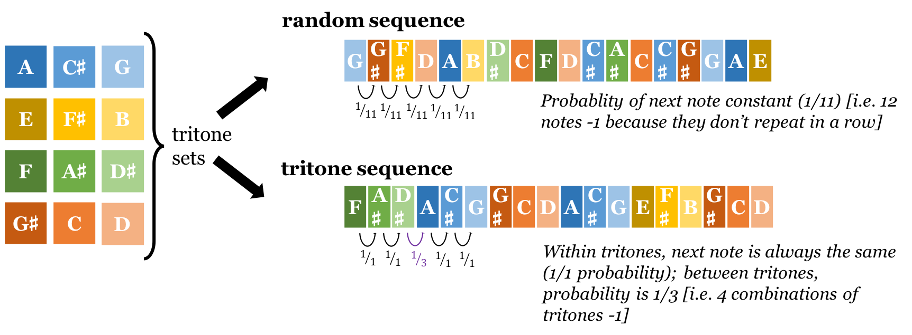
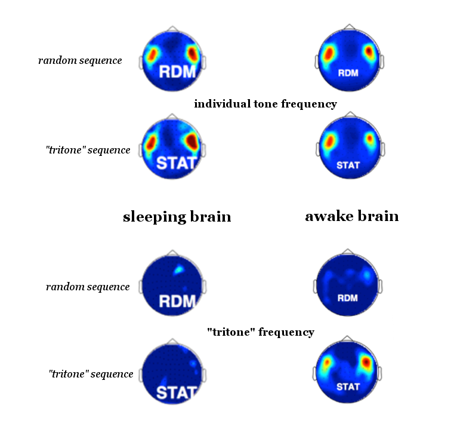

```{r setup, include=FALSE}
knitr::opts_chunk$set(echo = TRUE)
```

<blockquote><span class="bqstart">“</span>The Director walked slowly down the line of cots. Rosy and relaxed with sleep, eighty little boys and girls lay softly breathing. There was a whisper under every pillow. The DHC halted and, bending over one of the little beds, listened attentively. […]  
&nbsp;&nbsp;&nbsp;&nbsp;&nbsp;'… all wear green,' said a soft but very distinct voice, beginning in the middle of a sentence, 'and Delta children wear khaki. Oh no, I don't want to play with Delta children. And Epsilons are still worse. They're too stupid to be able to read or write. Besides, they wear black, which is such a beastly colour. I'm so glad I'm a Beta.'<span class="bqend">”</span>  
<footer align="right">Brave New World, by Aldous Huxley<sup id = "a1">[1](#f1)</sup></footer></blockquote>


When we go to sleep, our senses don't. This should be fairly obvious for anyone who has an alarm clock. Trained over millions of years of evolutionary history, when a loud sound during sleep could be a sign that you're about to get eaten, our brain processes the sound of the alarm and (most of the time!) rouses us. So, if we can hear while we sleep, then can we hack this process and learn while we sleep? No; according to new research published in the journal [**Scientific Reports**](https://www.nature.com/articles/s41598-018-30105-5), our sleeping brains seem confined to learning only very basic associations.

Scientists at the Université libre de Bruxelles<sup id="a2">[2](#f2)</sup> invited participants to take a nap in a type of scanner that measures the magnetic field caused by the electrical activity of neurons. Once sleeping, they were played a series 12 notes (or tones). For half of the time, these notes were randomly ordered (the only stipulation being that consecutive notes did not repeat),<figure>
  
  <figcaption>Adapted from Farthouat<sup id="a2">[2](#f2)</sup></figcaption>
</figure> but in the other half the notes were arranged into 4 blocks of 3 called "tritones"†. Grouping the notes like this means that there is a statistical regularity to the series of notes (see image).In the real world, the ability to recognise statistical regularities in sounds thought to be important in language learning for infants<sup id="a3">[3](#f3)</sup>. Take a listen to the two samples below and see if you can pick out the one with the regularity!

<audio controls>
  <source src="./media/STAT.wav" type="audio/wav">
</audio>
<audio controls>
  <source src="./media/RAND.wav" type="audio/wav">
</audio>
<label for="show">
  <span>[Show answer]</span>
</label>
<input type=radio id="show" name="group">
<span id="content">**The first stream is the stream with the pattern, the block of three tones, in the second stream all of the same notes are randomly arranged.**</span>  

Every time the brain processes one of the notes (in either random or streams with regularity), the neural activity should be registered by the scanner. The notes play every 175 milliseconds and searching in this frequency the authors found evidence of brain activity associated with the individual notes. If the brain is recognising tritones, which include 3 consecutive notes, then they will be registered at a lower frequency - because, even though you get a new note every 175 milliseconds, you only get a new tritone every (3 ×175=) 525 milliseconds.

<figure>
  
  <figcaption>Adapted from Farthouat<sup id="a2">[2](#f2)</sup>. Rows 1-2: brain activity recognising individual notes is fairly even asleep and awake, whether they are the individual notes within tritones or the random notes. Rows 3-4: in the sleeping brains no brain activity picked up at at the frequency of the pattern, when awake the inactivity continued in random streams - but when the tritones were played neural activity was detected at the correct frequency.</figcaption>
</figure>
When participants were subjected to the sounds while awake, the scientists saw just that - the brain was able to recognise both the individual notes and the tritones. However, when participants were sleeping, only the individual notes appeared to be recognised (see image). Moreover, people who had been exposed to the sounds while sleeping were no better at perceiving the pattern compared to people who'd never been exposed to it before - showing that learning in sleep had not occurred<sup id="a2">[2](#f2)</sup>.

If Huxley's vision of the future in A Brave New World, where the population is conditioned with propaganda in their sleep, is keeping you awake at night then perhaps this is good news... although this research only looked at learning ability in NREM sleep (non-rapid eye movement sleep, which makes up most of our sleep and in which we rarely dream), so perhaps studying REM sleep in the future could yet make hypnopaedia a reality. Sleep well!

-- Adam

***

† The authors refer to these blocks of three notes as "tritones", but I'm assured by musician friends and colleagues that they bear no resemblance to the musical intervals of the same name. Also should not be confused with the Greek god of the sea (Ariel's dad).  

*References:*  
<sup id="f1">1</sup> Huxley, A., 1932. **Brave New World**. New York, NY: Harper Brothers. [↩︎](#a1)  
<sup id="f2">2</sup> Farthouat, J., A. Atas, V. Wens, X. De Tiege, & P. Peigneux, 2018. **Scientific Reports** *8*, 11719. [↩︎](#a2)
<sup id="f3">3</sup> Romberg, A. R., & J. R. Saffran, 2010. Statistical learning and language acquisition. **Wiley Interdisciplinary Reviews: Cognitive Science** *1*, 906-914. [↩](#a3)
